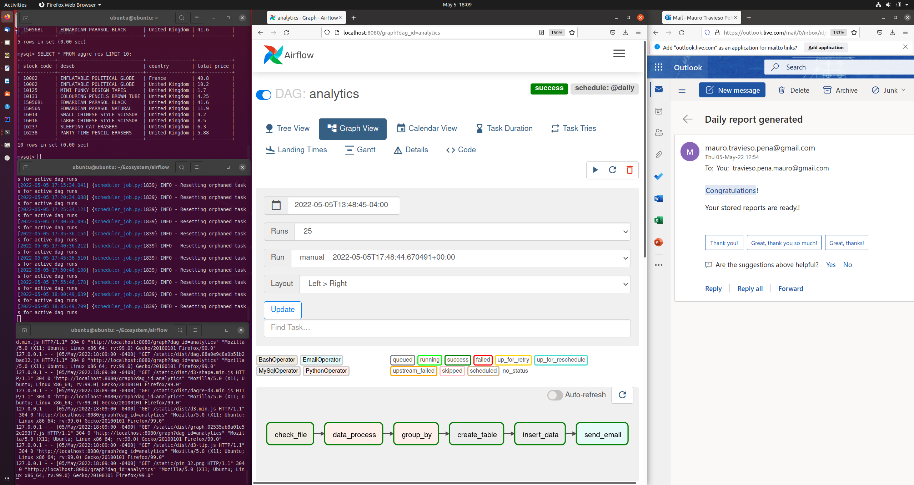
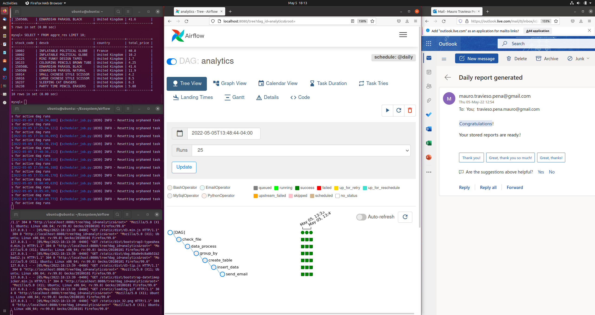

# Airflow - MySQL Integration and Email reporting

```
Airflow application: Check file existence
                     Apply the transformations to the data
                     -> Pre-processing
                     -> Data aggregation
                     -> MySQL table creation and filling
                     -> Email reporting (success & fail tasks) 

@author: Mauro Travieso
```
---

**DAG scheduler implementation results:**

* *Data to be processed:* 

|---|---|---|---|---|---|---|---|
|InvoiceNo|StockCode|Description|Quantity|InvoiceDate|UnitPrice|CustomerID|Country|
|536365|71053|WHITE METAL LANTERN #$|6|01-12-2010 08:26,3.39|17850|United_Kingdom|
|536365|84406B|CREAM CUPID HEARTS COAT HANGER|8|01-12-2010 08:26|2.75|17850|United_Kingdom|
|536365|84029G|KNITTED UNION FLAG HOT WATER BOTTLE|6|01-12-2010 08:26|3.39|17850|United Kingdom|
|536365|84029E|RED WOOLLY HOTTIE WHITE HEART.|6|01-12-2010 08:26|3.39|17850|United Kingdom|
|536365|22752|SET 7 BABUSHKA NESTING BOXES|2|01-12-2010 08:26|7.65|17850|United Kingdom|
|536365|21730|GLASS STAR FROSTED T-LIGHT HOLDER|6|01-12-2010 08:26|4.25|17850|United Kingdom|
|536366|22633|HAND WARMER UNION JACK|6|01-12-2010 08:28|1.85|17850|United Kingdom|
|536366|22632|HAND WARMER RED POLKA DOT|6,01-12-2010 08:28|1.85|17850|United Kingdom|
|536367|84879|ASSORTED COLOUR BIRD ORNAMENT|32|01-12-2010 08:34|1.69|13047|United Kingdom|


* *Data transformed:*

|---|---|---|---|---|---|---|---|---|
||InvoiceNo|StockCode|Description|Quantity|InvoiceDate|UnitPrice|CustomerID|Country|
|0|536365|71053|WHITE METAL LANTERN|6|01-12-2010 08:26|3.39|17850.0|United_Kingdom|
|1|536365|84406B|CREAM CUPID HEARTS COAT HANGER|8|01-12-2010 08:26|2.75|17850.0|United_Kingdom|
|2|536365|84029G|KNITTED UNION FLAG HOT WATER BOTTLE|6|01-12-2010 08:26|3.39|17850.0|United Kingdom|
|3|536365|84029E|RED WOOLLY HOTTIE WHITE HEART|6|01-12-2010 08:26|3.39|17850.0|United Kingdom|
|4|536365|22752|SET 7 BABUSHKA NESTING BOXES|2|01-12-2010 08:26|7.65|17850.0|United Kingdom|
|5|536365|21730|GLASS STAR FROSTED T LIGHT HOLDER|6|01-12-2010 08:26|4.25|17850.0|United Kingdom|
|6|536366|22633|HAND WARMER UNION JACK|6,01-12-2010 08:28|1.85|17850.0|United Kingdom|
|7|536366|22632|HAND WARMER RED POLKA DOT|6|01-12-2010 08:28|1.85|17850.0|United Kingdom|
|8|536367|84879|ASSORTED COLOUR BIRD ORNAMENT|32|01-12-2010 08:34|1.69|13047.0|United Kingdom|


* *Grouped data:*

|---|---|---|---|
|StockCode|Description|Country|total_price|
|10002|INFLATABLE POLITICAL GLOBE|France|40.8|
|10002|INFLATABLE POLITICAL GLOBE|United Kingdom|10.2|
|10125|MINI FUNKY DESIGN TAPES|United Kingdom|1.7|
|10133|COLOURING PENCILS BROWN TUBE|United Kingdom|4.25|
|15056BL|EDWARDIAN PARASOL BLACK|United Kingdom|41.6|
|15056N|EDWARDIAN PARASOL NATURAL|United Kingdom|11.9|
|16014|SMALL CHINESE STYLE SCISSOR|United Kingdom|4.2|
|16016|LARGE CHINESE STYLE SCISSOR|United Kingdom|8.5|
|16237|SLEEPING CAT ERASERS|United Kingdom|6.3|

* *Process result screen captures:*





