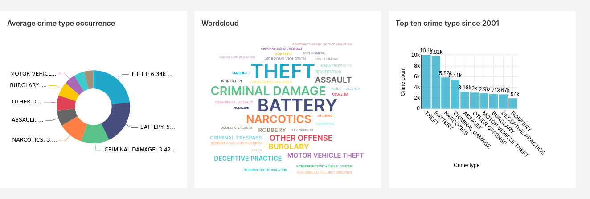

# Spark Application: **Crime Analysis from 2001 to Present**
                     
                     Use case analysis (Hadoop v3 ecosystem) 
                     * Creating Dataframe from file with more than 7M records (1.6 GB) 
                     * Performing in memory SQL operations using Scala
                     * Data fields projection and manipulation to reflect the crime count per month per type
                     * HDFS data management: output file storage compression and retrieve 
                 
 
 Author:  Mauro Travieso
 
 Version 1.0
 
 Bugs: none known
 
---

## Exploratory Data Analysis

* Fields name and data type
```
root
 |-- ID: integer (nullable = true)
 |-- Case Number: string (nullable = true)
 |-- Date: string (nullable = true)
 |-- Block: string (nullable = true)
 |-- IUCR: string (nullable = true)
 |-- Primary Type: string (nullable = true)
 |-- Description: string (nullable = true)
 |-- Location Description: string (nullable = true)
 |-- Arrest: boolean (nullable = true)
 |-- Domestic: boolean (nullable = true)
 |-- Beat: integer (nullable = true)
 |-- District: integer (nullable = true)
 |-- Ward: integer (nullable = true)
 |-- Community Area: integer (nullable = true)
 |-- FBI Code: string (nullable = true)
 |-- X Coordinate: integer (nullable = true)
 |-- Y Coordinate: integer (nullable = true)
 |-- Year: integer (nullable = true)
 |-- Updated On: string (nullable = true)
 |-- Latitude: double (nullable = true)
 |-- Longitude: double (nullable = true)
 |-- Location: string (nullable = true)
```

* Data show
```
+--------+-----------+--------------------+--------------------+----+------------+--------------------+--------------------+------+--------+----+--------+----+--------------+--------+------------+------------+----+--------------------+------------+-------------+--------------------+
|      ID|Case Number|                Date|               Block|IUCR|Primary Type|         Description|Location Description|Arrest|Domestic|Beat|District|Ward|Community Area|FBI Code|X Coordinate|Y Coordinate|Year|          Updated On|    Latitude|    Longitude|            Location|
+--------+-----------+--------------------+--------------------+----+------------+--------------------+--------------------+------+--------+----+--------+----+--------------+--------+------------+------------+----+--------------------+------------+-------------+--------------------+
|10224738|   HY411648|09/05/2015 01:30:...|     043XX S WOOD ST|0486|     BATTERY|DOMESTIC BATTERY ...|           RESIDENCE| false|    true| 924|       9|  12|            61|     08B|     1165074|     1875917|2015|02/10/2018 03:50:...|41.815117282|-87.669999562|(41.815117282, -8...|
|10224739|   HY411615|09/04/2015 11:30:...| 008XX N CENTRAL AVE|0870|       THEFT|      POCKET-PICKING|             CTA BUS| false|   false|1511|      15|  29|            25|      06|     1138875|     1904869|2015|02/10/2018 03:50:...|41.895080471|-87.765400451|(41.895080471, -8...|
|11646166|   JC213529|09/01/2018 12:01:...|082XX S INGLESIDE...|0810|       THEFT|           OVER $500|           RESIDENCE| false|    true| 631|       6|   8|            44|      06|        null|        null|2018|04/06/2019 04:04:...|        null|         null|                null|
|10224740|   HY411595|09/05/2015 12:45:...|   035XX W BARRY AVE|2023|   NARCOTICS|POSS: HEROIN(BRN/...|            SIDEWALK|  true|   false|1412|      14|  35|            21|      18|     1152037|     1920384|2015|02/10/2018 03:50:...|41.937405765|-87.716649687|(41.937405765, -8...|
|10224741|   HY411610|09/05/2015 01:00:...| 0000X N LARAMIE AVE|0560|     ASSAULT|              SIMPLE|           APARTMENT| false|    true|1522|      15|  28|            25|     08A|     1141706|     1900086|2015|02/10/2018 03:50:...|41.881903443|-87.755121152|(41.881903443, -8...|
+--------+-----------+--------------------+--------------------+----+------------+--------------------+--------------------+------+--------+----+--------+----+--------------+--------+------------+------------+----+--------------------+------------+-------------+--------------------+
only showing top 5 rows
```

* Total number of records: 7,279,448

---

# Dataset loading with projection of fileds of interest

``` 
root
 |-- crime_date: string (nullable = true)
 |-- crime_type: string (nullable = true)
```

* Resulting data
```
+--------------------+----------+
|          crime_date|crime_type|
+--------------------+----------+
|09/05/2015 01:30:...|   BATTERY|
|09/04/2015 11:30:...|     THEFT|
|09/01/2018 12:01:...|     THEFT|
|09/05/2015 12:45:...| NARCOTICS|
|09/05/2015 01:00:...|   ASSAULT|
+--------------------+----------+
only showing top 5 rows
```

* Total number of records: 7,279,448


# SparkSQL operations on fileds of interest to obtain the crime count per month per type and storing the results in HDFS as text file, tab delimited and with compression
```
+----------------+------------------------------+---------------+
|crime_year_month|crime_count_per_month_per_type|     crime_type|
+----------------+------------------------------+---------------+
|          200101|                          7866|          THEFT|
|          200101|                          6525|        BATTERY|
|          200101|                          4714|      NARCOTICS|
|          200101|                          3966|CRIMINAL DAMAGE|
|          200101|                          2800|  OTHER OFFENSE|
+----------------+------------------------------+---------------+
only showing top 5 rows
```

* Total number of records: 6,922

# Text file stored data with compression and tab delimited retrieved from HDFS

```
+------+----+---------------+
|   _c0| _c1|            _c2|
+------+----+---------------+
|200101|7866|          THEFT|
|200101|6525|        BATTERY|
|200101|4714|      NARCOTICS|
|200101|3966|CRIMINAL DAMAGE|
|200101|2800|  OTHER OFFENSE|
+------+----+---------------+
only showing top 5 rows
```

Spark Session stopped

Process finished with exit code 0

---

# Dashboarding the results in Superset



